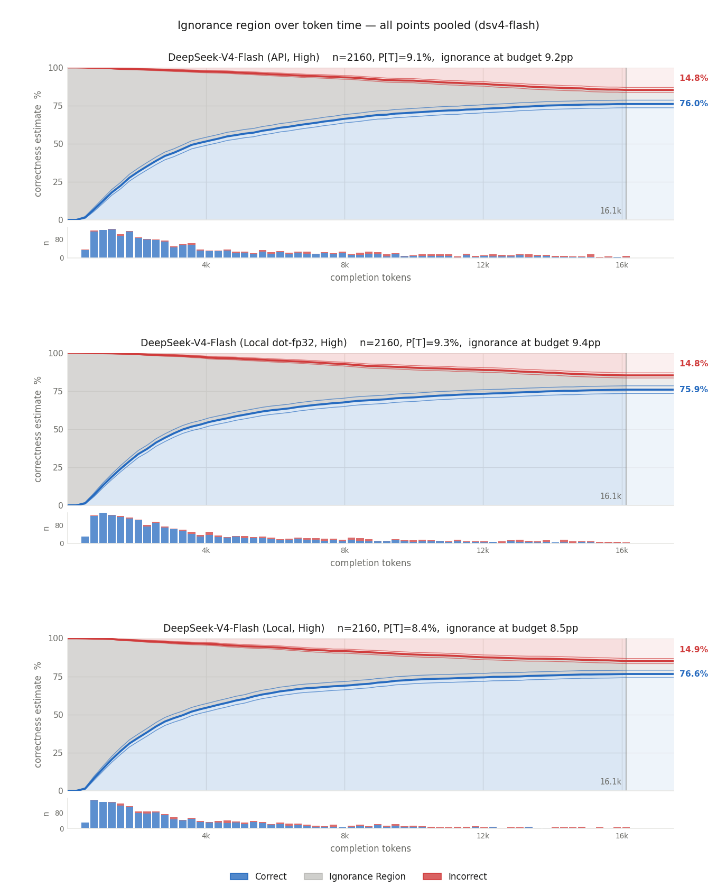

# CLAUDE-TP8.md — DS4-Flash **GA (0731)** on 8x L40S via vLLM-Moet, TP8

## STATE AS OF 2026-08-03 (read this first on a cold start)
**Nothing is serving.** The box was taken down deliberately at the end of the
2026-08-03 session. Repo clean at `287e206`, 73/73 patches verify and check.

Next action is to restore the agentic config and start deep-swe:
```bash
tmux new-session -d -s ds4 "MAXLEN=262144 NUM_SEQS=4 PREFIX_CACHING=1 \
  BATCHED_TOKENS=1024 ./serve_l40s_ds4_tp8.sh 2>&1 | tee logs/tp8-agentic.log"
```
Expect `GPU KV cache size: 4,418,044 tokens` / `16.85x` at 256k. Prefix caching
ON is correct and gated — 2.5x, 99.4% hit rate, and it causes none of the
output variation (both arms are equally nondeterministic; see bug #5).

Settled this session, newest first:
- **Bug #5 root-caused and partly fixed.** `top_k_per_row_prefill` (upstream
  compiled op) emits the same candidate set in a nondeterministic order;
  `VLLM_DSV4_DETERMINISTIC_TOPK=1` sorts it and makes ctx 2048–10240
  bit-reproducible. **Defaults to 0** — cost unmeasured end-to-end. A second,
  probabilistic source remains above ~11k. Sections below.
- **Prefix caching gated and cleared.** Enable it for agentic work.
- **fp32 MLA dot resolved null**, knob dropped, int8 KV unblocked.
- **`--enable-prompt-tokens-details`** now always passed, so `cached_tokens` is
  visible at the API.
- **`chat_utils.py` system-role tools fix** ported as `c6777df`.

Open and deliberately not done: benchmark the TOPK knob before defaulting it on;
chase the ~11k source; run `scratchpad/pc_needle.py` (written, never executed —
it is the test that would catch long-context *corruption* rather than mere
difference).

Companion to `l40s-4x-runbook.md` (the 4x L40S / preview-weights box).
Everything in the parent doc still applies unless contradicted here.
Field-tested 2026-08-01/02 on the 8x box. Launcher: `serve_l40s_ds4_tp8.sh`.

## VALIDATED against the DeepSeek cloud API (2026-08-02)

After bugs #1-#4 and the reasoning-effort ladder were fixed, a 26,901-prompt
[ReasonScape](https://github.com/the-crypt-keeper/reasonscape) run on this box lands **statistically indistinguishable from the
DeepSeek cloud API** on the task where both were measured, and the model places
#5 on the ReasonScape leaderboard with strong thinking-efficiency.

Same-task head-to-head (`dates`, matched prompts, matched sampler):

| arm | n | invalid | trunc | score |
|---|---|---|---|---|
| this box, TP8 | 1341 | 0 | 0.0022 | 0.972 ± 0.009 |
| DeepSeek cloud | 1336 | 0 | 0.0060 | 0.975 ± 0.008 |

Difference **-0.003 ± 0.012** (z = 0.49). Prompt tokens 149.2 on *both* arms --
an independent confirmation that the encoder now renders byte-identical prompts
to cloud (see the reasoning-effort section).

Full local sweep, 26,901 prompts, invalid 0.0008 overall:

| base task | n | invalid | trunc | score | completion |
|---|---|---|---|---|---|
| **all** | 26901 | 0.0008 | 0.0124 | **0.954 ± 0.003** | 1691.6 |
| tables | 3456 | 0 | 0 | 0.990 ± 0.003 | 463.2 |
| arithmetic | 2078 | 0 | 0.0048 | 0.979 ± 0.006 | 2598.6 |
| letters | 1727 | 0 | 0.0006 | 0.979 ± 0.007 | 1857.7 |
| dates | 1338 | 0 | 0.0045 | 0.976 ± 0.008 | 645.2 |
| shuffle | 3356 | 0 | 0.0012 | 0.976 ± 0.006 | 1188.0 |
| objects | 2301 | 0 | 0.0013 | 0.965 ± 0.007 | 722.4 |
| boolean | 2342 | 0 | 0.0242 | 0.963 ± 0.011 | 3751.4 |
| cars | 2300 | 0 | 0.0017 | 0.945 ± 0.011 | 890.9 |
| brackets | 2301 | 0.0091 | 0.0013 | 0.942 ± 0.010 | 2287.1 |
| sort | 2014 | 0 | 0.0010 | 0.940 ± 0.010 | 1172.8 |
| shapes | 1710 | 0 | 0.0372 | 0.917 ± 0.013 | 1349.4 |
| sequence | 1978 | 0 | 0.0843 | **0.837 ± 0.016** | 4053.5 |

`sequence` was the one outlier worth suspecting -- low score, 8.4% truncation,
4k completions. **Confirmed as a model property, not a port defect:** cloud
scores 0.837 ± 0.016 on the same task (n=1963) with *higher* truncation
(9.1%) and longer completions (4562 vs 4054). Identical to three decimals.

Caveat on coverage: these prompts average 366 tokens. Nothing here reaches the
L=2048 boundary where bugs #1 and #2 lived, so this run does **not** validate
the long-context path. A 2-14k prompt sweep is the instrument for that, and it
needs sub-2048 points as a control (below 2048 the indexer top-k is a no-op,
which is exactly why those bugs stayed invisible for so long).

## RESOLVED NULL (2026-08-02): fp32 sparse-MLA dot — synthetic error down, no functional difference

**Status: done. No movement.** Per the pre-registered rule below, the dot was
not the lever: drop it and go to int8 KV. Served as `deepseek-v4-flash-dotf32`,
log `logs/tp8-dotf32.log`. Result and the general principle it establishes are
in "The result" and "Why this closes the numerics family", below.

### The change
`VLLM_DSV4_MLA_DOT_FP32=1` (launcher: `MLA_DOT=fp32`) runs the sparse-MLA
attention dots in fp32 on tf32 tensor cores instead of bf16, and halves
`BLOCK_N` 32 -> 16 because fp32 operand tiles measured 295 KiB via AOT compile
against Ada's 99 KiB smem. Both parts are required; the tile size is not
optional.

Provenance: iSevenDays/vLLM-Moet@`b158280`, which measured **16K needle
0.948 -> 0.966** from this change. That was on his IQ2_XXS expert path, so the
magnitude should not be expected to carry to Marlin — attention-dot precision
is orthogonal to expert quantization, but his baseline is not ours.

### Why we expected it to matter
The init self-test has always printed `worst_row_rel ~7.6e-03` for the bf16
path and the runbook called that "expected". It is a **per-layer** number that
compounds across 43 layers, and bug #4 established that this model turns 1 bf16
ULP in an expert output into ~0.09 nats median at the prompt-logprob level.
A 7.6e-03 per-layer attention error is a far larger perturbation than the one
that cost a day of investigation.

### What the self-test actually said
**7.634e-03 -> 6.849e-03.** Change confirmed live (kernel build hash
`c873e024981d` -> `bb0f20ac5cc7`), but that is only ~10% where bf16 (8 mantissa
bits) -> tf32 (11) should be ~8x.

**The reason is structural and worth remembering: the fp32 dot only upgrades
one operand.** `q` arrives from the model as bf16, so `q.to(tl.float32)` widens
the container without recovering a single bit — the query stays 8-bit-mantissa
on both paths. Only `k` (dequantized to fp32 in `_dsv4_gather_k`) and `p` (the
fp32 softmax probabilities) actually gain precision. Roughly half the
arithmetic improved, and the self-test agrees.

Caveat on reading that number at all: the self-test compares kernel vs torch
reference, and **both read the same fp8 bytes**, so fp8 KV quantization error is
common-mode and invisible to it. The 10% bounds how much of the kernel-reference
divergence the dot was responsible for. It says nothing about absolute error,
and nothing about end-to-end quality. Only the eval answers that.

### Cost: apparently nil
| | bf16 dot (baseline) | fp32 dot |
|---|---|---|
| decode tok/s, 1K/512, c=1 | 54.63 | 54.38 |
| median TPOT | 18.15 ms | 17.78 ms |
| median TTFT | 324 ms | 312 ms |

Within run-to-run noise at n=3, despite `BLOCK_N` halving. Decode is
bandwidth-bound here so the extra N-loop iterations hide under memory traffic.
**Not yet measured at 8K prefill or high concurrency**, which is where a
compute-bound cost would show. Do that before believing "free".

### The probe: `sequence`
Chosen because it has the most headroom (0.837) *and* because its failure mode
matches the mechanism: highest truncation in the suite (8.4%) and by far the
longest completions (4,054 tokens vs 463 for `tables`). A compounding per-layer
attention error is a long-generation pathology; `tables` could not show it.

Baselines to beat — **cloud scores the same 0.837 ± 0.016** (n=1963) with
*higher* truncation (9.1%) and longer completions (4562).

### How to read the result
- **No movement** -> the dot was not the lever; drop it (it costs nothing but
  complexity) and go to int8 KV, which attacks the operand the dot cannot.
- **Local improves past cloud** -> we are no longer matching the reference, we
  are beating it. That is plausible (cloud runs Hopper/Blackwell attention
  kernels with their own precision choices) and is not a bug, but it changes the
  claim from "indistinguishable from cloud" to "better than cloud", which needs
  its own evidence. Cloud is a correctness reference, not a precision ceiling.
- **Local degrades** -> suspect the `BLOCK_N=16` tiling, not the precision.

### The result: null on every readout that matters
`sequence` @ 16k budget, reasoning effort High, adjusted 95% CI:

| arm | n | score | trunc | mean completion |
|---|---|---|---|---|
| local, bf16 dot (baseline) | 1978 | **0.837 ± 0.016** | 8.43% | 4053.5 |
| local, fp32 dot | 1959 | **0.837 ± 0.016** | 9.31% | 4288.6 |
| cloud API | 1963 | **0.837 ± 0.016** | 9.1% | 4562 |

Three arms, same score to three decimals. The synthetic error *did* go down
(self-test `7.634e-03 -> 6.849e-03`); nothing downstream noticed.

The length metrics move toward cloud (completions 4054 -> 4289 against cloud's
4562; truncation 8.43% -> 9.31% against cloud's 9.1%), which is suggestive and
is **not** claimed as signal. The pooled tail detail shows why:



n=2160 per arm, budget 16.1k. The distribution barely shifts; the mean is
dragged by an enormous long tail, so mean completion length is a tail statistic
here, not a location statistic. Do not run a t-test on it.

What the figure *does* establish is stronger than the thing it fails to show.
Among everything that resolves inside the budget, the correct:incorrect ratio is
identical across all three arms:

| arm | correct | incorrect | ignorance @ budget | correct:incorrect |
|---|---|---|---|---|
| API, High | 76.0% | 14.8% | 9.2pp | **5.14** |
| local fp32 dot, High | 75.9% | 14.8% | 9.4pp | **5.13** |
| local bf16 dot, High | 76.6% | 14.9% | 8.5pp | **5.14** |

The arms differ *only* in how much mass has not resolved yet, and local is on
the favourable side of cloud on that. Unresolved-at-budget is a budget artifact,
not a capability difference.

**This also answers the 32k question without running it.** Extending the budget
converts grey into blue and red at a ratio that is already measured, and already
identical across arms. A 32k run relabels the same mass in all three panels at
5.14:1 and cannot discriminate. It is not worth 2-3 h/arm.

### Why this closes the numerics family
Bug #4 calibrated the sensitivity: 1 bf16 ULP in an expert output moves prompt
logprobs ~0.09 nats median, 2.1 max. Yet this eval cannot see an intervention
that measurably reduced attention-dot error, and the 26,901-prompt head-to-head
puts us at -0.003 ± 0.012 against a cloud arm that is very likely a different
expert quantization on different silicon.

Those coexist because the perturbation is **non-directional**. It is diffusion,
not drift: large in logprob space, mean-centred, so it does not accumulate into
systematic task error. That is the line the four bugs fall on, and it is the
reason the method worked:

- **Bugs #1-#3 were directional.** A wrong byte layout biases the top-512
  selection the same way every time and compounds with depth; a race biases
  nothing but destroys reproducibility outright. Bias survives averaging, so a
  behavioural oracle (cloud) resolved all three — 11/40 truncations vs cloud's
  0/40, p = 0.0129.
- **Bug #4 and this experiment are symmetric.** Reassociation and rounding have
  no preferred direction, so they are invisible at task level *by construction*.
  No amount of eval sensitivity changes that, because there is no bias to detect.

**Cloud discriminates bias. It cannot discriminate variance.** That is the
general statement of what this methodology can and cannot catch, and it should
be the first thing a future reader takes from this file.

Practical consequence: this eval has reached its resolution floor for the
numerics family. The **fp32 TP all-reduce** test specced at the end of the bug
#4 section (gaps 1+2, one contiguous patch in `moe_runner.py` — upcast at the
combine point, keep fp32 through `tensor_model_parallel_all_reduce`, downcast
once after) would be measured with this same instrument and would return this
same non-answer. Do not run it unless a different readout appears. Recorded as
specced-and-deliberately-not-run, not as untried.

Standing claim: **indistinguishable from cloud at the limit of what we can
measure, with the resolved-answer ratio matching to three figures.** That is a
stronger statement than a pile of null p-values.

### Queue behind this
1. **int8 KV** (`VLLM_DSV4_KV_INT8=1`, iSevenDays). The packed `fp8_ds_mla` row
   already carries a per-64-element UE8M0 power-of-two scale, which makes
   E4M3's own exponent bits largely redundant. Reinterpreting the byte as
   signed int8 gives **7 mantissa bits + sign instead of 3 + sign at identical
   storage** — same 584 B/token, same KV pool, zero extra VRAM. Implemented as
   a second pass that overwrites only the 448 NoPE data bytes + 7 scale bytes
   after the stock C++ op, so no CUDA kernel replacement. This is the larger
   lever and it attacks what the fp32 dot cannot. **UNBLOCKED 2026-08-02** — the
   dot experiment resolved null, so nothing is competing for attribution now.
   Note the caveat above before spending a run on it: int8 KV is a *precision*
   lever, and precision levers are exactly what this eval has just been shown
   unable to resolve. It is worth running only if it is expected to be
   directional (a quantization-grid change can be, unlike rounding), and that
   expectation should be stated before the run, not after.
2. **dspark IMA discriminator.** Our crash is an illegal memory access at
   ~2k tokens. Two candidate causes, separable in one run: does it crash at a
   fixed *token position* (~2048, where the compressed candidate count hits
   `index_topk=512` and top-k flips from no-op to real selection — exactly
   where bugs #1 and #2 lived) or on a fixed *batch index* (the padded-tail
   leak that `dspark_pad_to_bucket` addresses)? Position -> boundary bug.
   Batch -> padded tail. Note iSevenDays' T7 found `deepseek_mtp` fails at
   *weight load* on 0731 (`KeyError: model.layers.43.mtp_block.main_norm.weight`,
   the checkpoint is DSpark-bound), which is a different failure and does not
   explain ours.

## BUG #5 CANDIDATE (2026-08-02): greedy is nondeterministic above 2048 — bug #3's fix does not reach there

**The determinism claim in the bug #3 section is true only below 2048 tokens of
context.** Above it, greedy decoding is not reproducible, with
`VLLM_DSV4_DETERMINISTIC_MOE=1` active and prefix caching off.

### The measurement
`scratchpad/det_probe.py` — `max_tokens=1` so only the forward pass is in play
(no decode, no KV reuse, no sampling), `temperature=0`, `seed=0`, sequential
single requests, same process. Compares the top-20 next-token logprobs across
6 repeats of a byte-identical request. Text comparison is a *thresholded*
readout — it only shows a difference once a perturbation flips an argmax — so
the logprobs are the continuous signal underneath.

| ctx | prompt tok | distinct logprob sets / 6 | max abs Δlogprob |
|---|---|---|---|
| 1900 | 1916 | 1 | 0 |
| 1980 | 1996 | 1 | 0 |
| 2015 | 2032 | 1 | 0 |
| 2031 | **2048** | **1** | **0** |
| 2047 | **2064** | **6** | **4.43 nats** |
| 2063 | 2080 | 6 | 1.94 |
| 2200 | 2217 | 6 | 1.83 |
| 24000 | 24017 | 6 | 2.14 |

Bit-identical at or below prompt 2048. Every repeat differs above it. Not a
gradual onset — a step.

### It is NOT chunked prefill (ruled out)
`BATCHED_TOKENS=1024` makes prompt 2048 exactly two prefill chunks and 2064 the
first length needing a third, so the chunking boundary and the indexer boundary
coincide *exactly* at 2048. Re-ran the whole probe at `BATCHED_TOKENS=4096`,
where everything through prompt 4096 is a single chunk:

| ctx | prompt tok | batched=1024 | batched=4096 |
|---|---|---|---|
| 2031 | 2048 | bit-identical | bit-identical |
| 2047 | 2064 | 6 sets | **6 sets** |
| 3072 | 3089 | 6 sets | 6 sets (argmax flips) |

The crossing does not move. The boundary is a property of the sequence, not of
the batching — `index_topk=512` × ratio-4 = 2048 compressed candidates, the same
boundary as bugs #1, #2 and the termination collapse. Fourth time.

### Why this was not caught before, and it is the same trap as bug #2
Bug #3 verified determinism on a **77-token** prompt (`76/77 prompt logprobs
differ -> 0/77 bit-identical`). Below 2048 the indexer top-k is a no-op — every
compressed candidate is selected regardless of score — so any residual
ULP-scale nondeterminism is *absorbed* and cannot reach the output. The
verification ran entirely inside the regime where the bug it would have caught
is structurally invisible.

That is the third instance in this project of a green test that could not fail:
`pack_dsv4_reference_cache` (checker shared the layout assumption it checked),
vLLM's `high` reasoning branch (tests asserted a no-op), and now this. The
pattern to distrust: **a test whose passing regime excludes the failure mode.**

### What this does and does not say
- It does **not** make bug #3's fix useless. Below 2048 that fix is what makes
  the run bit-identical; before it, even 77-token prompts varied by 3.7 nats.
  The fix is necessary and incomplete, not wrong.
- It does mean the 5.3% we pay for `DETERMINISTIC_MOE=1` **does not buy
  reproducible greedy decoding at any realistic context length.** Re-decide
  whether to keep paying it.
- Whether the residual source also exists below 2048 (masked by the no-op) or
  only exists above it is **unknown from output alone** — masking and absence
  are indistinguishable at the API.
- Magnitudes (1.6–4.4 nats max over top-20) are consistent with the bug #4
  calibration: ~1 ULP amplified. This looks like a discrete *selection* flip
  driven by a tiny score perturbation, not corruption.

### ORACLE RESULT (2026-08-02): not tie-breaking, not masking — the sparse attention path
Ran `VLLM_DSV4_TOPK_ORACLE` with `_PREFILL=1`, `ENFORCE_EAGER=1`,
`CUDAGRAPH_MODE=NONE`, caching off (a cache hit skips prefill and emits no
records), two byte-identical requests, comparing records grouped by
`(layer, compressed seq_len)`.

**1. It is not tie-breaking.** 20/21 layers had *logits* differing between the
two runs; 0/21 had identical logits with a differing selection; 0/21 had any tie
at the cut line. Both runs scored `exact: true, miss: 0, hit: 512`. The selector
is doing its job perfectly on inputs that already differ.

**2. It is not "masked below 2048" — it is absent there.** With `_MIN=0`:

| compressed seq_len | logits differ | max rel | first diverging layer |
|---|---|---|---|
| 256 | 0/21 | 0.00% | – |
| 379 | 0/21 | 0.00% | – |
| **512** | **0/21** | **0.00%** | – |
| **515** | **20/21** | **4.45%** | **4** |

Bit-identical at exactly `k_select = 512` compressed candidates, nondeterministic
at 515. The `>k_select` regime *creates* the nondeterminism rather than merely
revealing it. (Earlier working hypothesis — that a race existed everywhere and
the no-op absorbed it — is **wrong**, disproved by this table.)

**3. The MoE is exonerated.** `det-moe=1` was active and the MoE runs at every
layer irrespective of sequence length. A racy MoE would diverge at seq 256/379/512
too. It does not.

**4. Onset and growth.** Divergence appears by layer 4 and compounds with depth:

| layer | 4 | 10 | 18 | 26 | 34 | 42 |
|---|---|---|---|---|---|---|
| rel Δ finite_max | 0.50% | 1.08% | 1.47% | 1.54% | 1.79% | 3.86% |

Caveat on reading the onset: `finite_max` is a scalar summary, so a layer whose
max matches is not proven bit-identical row-wise, and only every other layer
carries an indexer. Read it as "present by layer 4", not "originates at layer 4".

**Where that leaves the suspect.** Layer 2's logits are identical and its
selection is exact with no tie, so layer 2 selects the same 512 indices in both
runs — yet layer 4's logits differ. The perturbation is injected between them,
by something that engages only when the selection is real: the **sparse-MLA
attention over a scattered 512-of-N gather** (`triton_sparse_mla_dsv4.py`, fork
code, same file family as bug #2). Below the boundary every candidate is
selected and that path is either bypassed or degenerate.

**Confirmatory test, not yet run:** `VLLM_DSV4_DOUBLE_MODULE=<sparse attn
substring>` calls the module three times on identical inputs and reports
disagreement (three, not two, so an accumulating output buffer shows as a
growing delta rather than a false positive). At ctx 2047 that is a direct
yes/no on "this kernel is racy", with no inference from downstream logits.
Needs `ENFORCE_EAGER=1`; `SharedExperts` asserts single-call, so filter to the
attention module.

### LOCALISED (2026-08-02): the sparse-MLA attention is ORDER-SENSITIVE, and the kernel is not racy

**Forward trace.** `VLLM_DSV4_FWD_TRACE` (1223 modules, `ENFORCE_EAGER=1`, no
cudagraphs, caching off), two byte-identical requests at ctx 2047, split on
`model.embed_tokens` into 9 passes and compared chunk-for-chunk:

| prefill chunk | tokens | compressed cand. | result |
|---|---|---|---|
| 0 | 1024 | 256 | **bit-identical** |
| 1 | 1024 | 512 | **bit-identical** |
| 2 | 15 | 515 | 573 modules differ |

Within chunk 2, in execution order:

```
[36] out same  ColumnParallelLinear   layers.2.attn.wq_b
[37] out DIFF  RowParallelLinear      layers.2.attn.wo_b   <- input ALREADY differs
```

Layers 0–1, both compressors, `indexer.indexer_op`, `indexer`, and `wq_b` are
all bit-identical. The divergence is injected **between `wq_b` and `wo_b`** —
the sparse-MLA attention core, which is not an `nn.Module` and so carries no
hook. Layer 2 is the first indexer layer. `MoERunner` also shows
"input same, output differs", but that is an artifact of fingerprinting only the
*first* tensor arg; `DeepseekV4MoE` immediately after shows `IN DIFF`, so the
MoE inherits rather than injects — consistent with the oracle.

**The kernel itself is NOT racy** (`scratchpad/mla_repro.py`,
`mla_repro2.py`). Standalone, no server, 5 repeats per configuration:

| geometry | candidate counts swept | distinct outputs | poison leak |
|---|---|---|---|
| plain SWA cache | 128…1024 incl. 512/513/516 | 1 | 0 |
| engine geometry: packed fp8 compressed cache + `extra_sparse_indices` + sinks, T=15 | 128…1024 incl. 511/512/513/516 | 1 | 0 |

Checked two ways: R calls on one set of tensors, and R calls with inputs
reallocated between calls (same values, new memory — which would expose a read
of memory the kernel does not own, the bug #2 shape). Zero difference either
way, and a poisoned `out` buffer comes back fully overwritten, so the
`torch.empty` allocation at line ~547 is not leaking.

**But it IS order-sensitive.** Same index *set*, permuted per row:

| n_extra | 256 | 512 | 516 | 1024 |
|---|---|---|---|---|
| max abs Δ under permutation | 1.56e-02 | 1.56e-02 | 1.56e-02 | 7.81e-03 |

~1 bf16 ULP at that magnitude. Candidates are accumulated in index order and
float addition is not associative — the same defect family as bug #4, in the
attention instead of Marlin.

**The mechanism this implies.** Below 512 compressed candidates the top-k is a
no-op: every candidate is selected and the index list comes out in natural
order, so the order is stable and the run is reproducible. Above 512 a real
selection runs; if it emits the same set in a varying order, the attention
rounds differently, and that ~1 ULP at layer 2 compounds through 43 layers
(0.50% at layer 4 → 3.86% at layer 42) into the 1.6–4.4 nat logprob spread.
Every other candidate is excluded: kernel race (ruled out above), tie-breaking
(0 ties at the cut), the MoE (exonerated twice), chunked prefill (boundary does
not move with `BATCHED_TOKENS`), and masking below the boundary (logits are
genuinely identical at 512).

### THE ORDER HYPOTHESIS IS DEAD (2026-08-02) — raw index dump, element-wise
Added `VLLM_DSV4_TOPK_ORACLE_RAW=1` (dumps the selected index vector in emission
order as `sel_idx`) and diffed two identical ctx-2047 requests element-wise
rather than as sets:

| layer | logits | selection vector | positions differing |
|---|---|---|---|
| **2** | **same** | **IDENTICAL** | **0 / 512** |
| 4 | DIFF | different set | 497 |
| 6 | DIFF | same set, reordered | 388 |
| 10 | DIFF | different set | 310 |
| … | DIFF | 10 reordered / 10 different-set | – |

**At layer 2 — the first indexer layer, and the one where the injection happens —
the indexer is completely deterministic: identical logits AND an identical index
vector, same set and same order.** The attention still diverges there. So
ordering is not the trigger. The reordering and set changes from layer 4 down are
*consequences* of logits that already differ, not causes.

The kernel is cleared as well, now including engine page size:

| pbs | n_extra 512 / 515 / 516 | distinct outputs | poison leak |
|---|---|---|---|
| 64 | all | 1 | 0 |
| **256** (engine `BLOCK_SIZE`) | all | 1 | 0 |

### ROOT CAUSE (2026-08-03): `top_k_per_row_prefill` emits a nondeterministic ORDER — upstream, not the port

Every link is measured.

**1. The selector permutes on bitwise-identical input.** Raising
`VLLM_DSV4_TOPK_ORACLE_PREFILL` from 1 to 16 (all query rows of the final chunk,
not just the last one) and diffing `sel_idx` element-wise at layer 2:

| row | logits max, run A / B | logits | selection | positions differing |
|---|---|---|---|---|
| 3 | 3.520913 / 3.520913 | same | **same set, reordered** | 315 / 512 |
| 5 | 2.665767 / 2.665767 | same | **same set, reordered** | 384 / 512 |
| 10 | 2.995578 / 2.995578 | same | **same set, reordered** | 127 / 512 |
| 12, 13 | – | same | identical | 0 |
| **totals** | | **all same** | **10 reordered, 2 identical, 0 different-set** | |

Identical logits in, identical candidate *set* out, different *order*. The
earlier "layer 2 is clean" reading was an artifact of `_PREFILL=1` sampling one
row out of fifteen — and it happened to land on one of the two stable rows.

**2. The order survives to the kernel.**
`compute_global_topk_indices_and_lens` (`deepseek_v4/common/ops/cache_utils.py:426`)
is a positional map — local index at position *p* → global slot at position *p* —
so the permutation passes straight through into `extra_sparse_indices`.

**3. The gathered KV sequence therefore differs while the set does not.**
Sparse-MLA IO trace at layer 2, chunk 2:

```
q=same  idx_main=DIFF  idx_extra=DIFF
  kv_main_rows   content(set)=same  sequence(ord)=same   1920/1920
  kv_extra_rows  content(set)=same  sequence(ord)=DIFF   7680/7680
```

7680 = 15 tokens × 512 candidates. (`idx_*` differing between two requests is
expected and benign on its own — the block allocator reuses freed blocks in a
different order. Only the *ordered* gather fingerprint separates benign
re-addressing from a real change, which is why the first version of that probe,
built on `torch.unique`, could not see this.)

**4. The attention is order-sensitive** — ~1 bf16 ULP for a permuted but equal
index set (1.56e-02 at 256/512/516 candidates), measured standalone.

**5. That compounds** — layer 2 → 0.50% by layer 4 → 3.86% by layer 42 → 1.6–4.4
nats of prompt-logprob spread.

**Why exactly 2048:** below `k_select = 512` compressed candidates the top-k is
a no-op, every candidate is selected and the list comes out in natural order, so
order is stable and the run is bit-reproducible. Above it a real selection runs.

**This is upstream vLLM, not the sm89 port.** `top_k_per_row_prefill` is a
compiled op from the official wheel (`torch.ops._C.top_k_per_row_prefill`,
`_custom_ops.py:2723`), it appears in none of our 73 patches, and the pristine
v0.25.1 baseline calls it identically (`sparse_attn_indexer.py:475`; overlay
:825). The fork's Triton kernel is exonerated — proven deterministic on
identical inputs at every geometry tested.

Scope caveat: the *selector* nondeterminism is hardware-independent, but whether
it *manifests* depends on the downstream attention being order-sensitive. Ours
is, measured. The SM100 trtllm kernel very likely is too — any FP accumulation
over candidates in list order would be — but that is **not measured here** and
should not be claimed without it.

**Fix:** sort each row's selected indices into a canonical order after the
top-k, before anything consumes them — 512 ints per row, negligible next to the
attention itself. Exactly the remedy shape as bug #3's `moe_align`
canonicalisation, and for the same reason: the arithmetic is order-sensitive and
the producer does not guarantee an order. Worth upstreaming, since the
nondeterministic producer is upstream's.

### FIX APPLIED AND VERIFIED (2026-08-03): `VLLM_DSV4_DETERMINISTIC_TOPK`

`_canonicalise_topk()` in `sparse_attn_indexer.py` sorts each row's selected
indices after the selector runs, before anything consumes them. Called at both
call sites: after `top_k_per_row_prefill`, and where the three decode selectors
(`cooperative_topk` / `persistent_topk` / `top_k_per_row_decode`) converge.
Padding is `-1` and consumers expect it last, so ascending sorts against a max
sentinel rather than sorting `-1` to the front. `=2` is a descending control,
mirroring the MoE knob.

**Verified with cudagraphs on, realistic config** (not the eager diagnostic
build), 6 repeats per length, `max_tokens=1`:

| ctx | before | with `=1` |
|---|---|---|
| 2047 | 6 distinct / 6 | **bit-identical** |
| 2063 | 6 distinct | **bit-identical** |
| 2200 | 6 distinct | **bit-identical** |
| 3072 | 6 distinct | **bit-identical** |
| 4096 | 6 distinct | **bit-identical** |
| 8192 | 6 distinct | **bit-identical** |
| 10240 | – | **bit-identical** |
| 12288 | – | 4 distinct, 0.783 nats |
| 16384 | 6 distinct | 6 distinct, 1.722 nats |
| 24000 | 6 distinct | 6 distinct, 2.442 nats |

The reproducible range goes from "nothing above 2048" to **2048–10240**, a 5x
extension, verified end-to-end.

**Cost: not yet measured end-to-end, and the knob defaults to 0 because of it.**
The sort is launch-latency bound — 0.132 ms/call at [1024,512], 0.132 at
[15,512], 0.132 at [4096,512], i.e. identical regardless of row count, so it is
three kernel launches plus a copy rather than real work. ×43 layers that is
~5.7 ms per forward, which would be brutal against a ~20 ms decode TPOT if it
survived cudagraph capture and near-free if it does not. **Benchmark before
defaulting it on**; fusing the where/sort/where into one kernel is the obvious
mitigation if the measurement says it matters.

### A SECOND SOURCE REMAINS above ~11k, different in character
Boundary between 10240 (clean) and 12288 (4 distinct of 6). Unlike the 2048
boundary this is **probabilistic, not a step** — 4/6, then 3/6 at 14336, then
6/6 at 15360 — which points at an intermittent race rather than a deterministic
order flip, i.e. a different mechanism rather than a remnant of this one.

Leading suspect, unverified: `compress_ratios` alternates **4 and 128**
(`config.json`), and the two ratios take different code paths. Ratio-4 goes
through `topk_indices_buffer`, which is what the fix canonicalises. Ratio-128
goes through `attn_metadata.c128a_prefill_topk_indices`, built separately in
`build_c128a_topk_metadata` (`deepseek_v4/sparse_mla.py:290`) and never touched
by the fix. Note `max_compressed_tokens` defaults to 8192 there, which is the
right magnitude but the wrong arithmetic — a ratio-128 layer has only L/128 = 96
compressed tokens at 12288 — so do not assume that constant is the trigger
without measuring.

Same instruments apply: `det_probe.py` to bisect, then `TOPK_ORACLE_RAW=1` with
`_PREFILL` set to the full chunk width (**not 1** — sampling a single query row
is what made layer 2 look clean and cost a whole hypothesis).

### Superseded: where bug #5 stood before the root cause
Established: the injection is in `layers.2.attn`, between `wq_b` and `wo_b`,
with **identical `q`** (wq_b bit-identical) and **identical selection indices**
(dumped and diffed), feeding a kernel that is **deterministic on identical
inputs** at every geometry tested. Those three facts together leave exactly one
unexamined input: **the KV cache contents**, which are mutated in place and are
therefore invisible to a module-output fingerprint — the same blind spot that
hid bug #2.

**Next step:** fingerprint the KV cache tensors themselves (compressed and SWA)
immediately before layer 2's attention read, on two identical requests. If they
differ, the defect is in the quantise-and-write path, not the read path. Also
worth checking whether a *separate* main/SWA selection exists that `sel_idx`
does not cover — the dump comes from the `top_k_per_row_prefill` call site only.

Excluded so far, each by measurement: kernel race, index ordering, tie-breaking
(0 ties at the cut), the MoE (twice), chunked prefill (boundary invariant to
`BATCHED_TOKENS`), masking below the boundary (logits genuinely identical at
512), and unwritten `out` elements (poison probe clean).

**Latent hazard recorded separately:** the sparse-MLA attention *is*
order-sensitive (~1 bf16 ULP under permutation of an equal index set, measured
at 256/512/516/1024 candidates). That is not what is biting here, because layer
2's order is stable — but any future change that makes selection order vary will
inject exactly this cascade, so canonicalising the indices is worth doing
defensively regardless of the root cause.

### Superseded: the tie-breaking hypothesis and the oracle plan
`VLLM_DSV4_TOPK_ORACLE` with `_DET=1` recomputes the logits and reports whether
they are reproducible. That separates the two candidates directly:
- logits bitwise reproducible but selection differs → **tie-breaking** in the
  top-k is order-dependent;
- logits differ → an upstream ULP-scale race that the selection amplifies.

Needs `ENFORCE_EAGER=1`. Run it at ctx 2047+, which the probe shows is the
cheapest length that reliably reproduces.

## What is different from the 4x box

| | 4x box (CLAUDE.md) | this box |
|---|---|---|
| GPUs | 4x L40S, all-PIX, ECC **on** (46 GiB visible) | 8x L40S, ECC **off** (48 GiB visible) |
| Topology | one PCIe switch, all PIX | **two PIX islands (0-3 \| 4-7), SYS across NUMA** |
| Weights | preview, 46 shards, 149 GB | **GA `DeepSeek-V4-Flash-0731`, 48 shards, 156 GB** |
| Path | `/home/.../models/DeepSeek-V4-Flash` | `/media/4TBNVME/models/DeepSeek-V4-Flash-0731` |
| TP | 4 | 8 |
| Weights resident | ~40 GB/card | **21 GB/card** |
| KV pool | 2.43 GiB = 158,769 tok | **23.0 GiB = ~859,000 tok** |
| Concurrency @16K | 4.85x | **52.4x** |

TP8 divisibility is clean: 256 experts, 64 attention heads, 64 index heads and
`moe_intermediate_size` 2048 all divide by 8.

**Topology caveat.** GPUs 0-3 and 4-7 sit on different NUMA nodes with only SYS
between them, so every TP8 all-reduce crosses the host bridge. Keep
`--disable-custom-all-reduce` (no P2P across the boundary). Consequence measured
below: TP8 does **not** beat TP4 on single-stream decode; what it buys is the
much larger KV pool (weights halve per card), i.e. concurrency, not latency.

## Setup deltas vs CLAUDE.md
Steps 1-4 of the parent runbook are unchanged and all still pass (fork HEAD
`5949a1c`, vLLM 0.25.1, flashinfer 0.6.14). Two notes:

- `ls patches/*.patch | wc -l` is **68** files; `git apply --directory=... ` from
  the repo root reports **68 Applied** here (the parent doc's "70" counted
  per-file hunks). Exit 0 and no `Skipped` is the real check.
- Weights are already on disk at the path above; no `hf download` needed.

## Speculative decoding: NOT AVAILABLE on this checkpoint (2026-08-01)

This was investigated properly and the conclusion is structural, not a tuning
problem. Do not re-litigate it without re-reading this section.

The GA checkpoint **does** ship draft modules — `mtp.0`, `mtp.1`, `mtp.2` (each a
full attention block + 256-expert FFN), plus `mtp.0.main_proj`,
`mtp.2.markov_head.markov_w{1,2}`, `mtp.2.confidence_head`, and top-level
`hc_head_*`. `config.json` carries `num_nextn_predict_layers: 1`,
`dspark_block_size: 5`, `dspark_target_layer_ids: [40,41,42]`,
`dspark_markov_rank: 256`. The model card documents exactly one flag:

    --speculative-config '{"method":"dspark","num_speculative_tokens":7,"draft_sample_method":"greedy"}'

What actually happens on this box:

1. **`method: deepseek_mtp` cannot load these weights.** It dies at init with
   `KeyError: 'model.layers.43.mtp_block.main_norm.weight'`
   (`models/deepseek_v4/nvidia/mtp.py:459`). Reason: `mtp.py` implements the
   classic DeepSeek head (`enorm`/`hnorm`/`eh_proj`), while the GA checkpoint's
   draft module uses the **DSpark layout** (`main_norm`/`main_proj`/
   `markov_head`). Those names appear **only** in
   `models/deepseek_v4/nvidia/dspark.py` — grep confirms it. So the fork
   README's proven "MTP k=2" path is unavailable on the GA weights: the classic
   drafter head is simply not in this checkpoint.

   **Why the fork's `MTP_TOKENS=1` default worked and now doesn't — the 0731
   drop changed the drafter architecture.** Verified by diffing the two
   checkpoints' `model.safetensors.index.json` (2026-08-01):

   | | preview `DeepSeek-V4-Flash` | GA `...-0731` |
   |---|---|---|
   | drafter blocks | 1 (`mtp.0`) | 3 (`mtp.0/1/2`) |
   | layout | `enorm`, `hnorm`, `e_proj`, `h_proj`, `norm` | `main_norm`, `main_proj`, `markov_head.markov_w{1,2}`, `confidence_head` |
   | config | `num_nextn_predict_layers: 1`, no `dspark_*` | adds `dspark_block_size: 5`, `dspark_target_layer_ids: [40,41,42]`, `dspark_markov_rank: 256` |
   | tensors | 69,187 | 72,317 (+3,130 ≈ two extra blocks) |

   The preview layout is precisely what `mtp.py` builds (`self.enorm`/`self.hnorm`,
   lines 85-86), which is why the fork measured +40% decode with MTP on sm89 at
   TP2. That measurement is real — it just does not transfer to GA weights.
   If MTP speedup matters more than GA's agentic gains, serving the **preview**
   checkpoint with `MTP_TOKENS=1` remains the fork's proven path.
2. **`method: dspark` loads but crashes under load.** Init is clean —
   `DSpark draft model loaded: 96 params`, KV pool 22.91 GiB / 819,918 tok /
   50.04x, i.e. it costs almost nothing in KV. Roughly 90 s into a
   512-in/4096-out c32 run every rank dies with
   `CUDA error: an illegal memory access was encountered`. The Python stack is
   not the culprit (CUDA reports these asynchronously); the true failing kernel
   was never isolated. One unverified lead: `load_dspark_model` builds the draft
   with `use_non_causal=True`, and the Ada Triton sparse-MLA port has no
   documented non-causal support. **Unproven — treat as a starting point, not a
   diagnosis.** The next step would be a rerun under `CUDA_LAUNCH_BLOCKING=1`.

Partial metrics from the crashing run (indicative only, from a run that died):
acceptance 15.1%, acceptance length 2.05 of 8, per-position acceptance decaying
36.9% → 4.5% by position 6. Even working, k=7 looks far too deep here; k=2-3
would be the range to try.

**Therefore: serve with `SPEC=none`.** The launcher defaults to it.

## Serving
```bash
cd moet-fork
./serve_l40s_ds4_tp8.sh                       # defaults: TP8, 16K, no spec
NUM_SEQS=64 ./serve_l40s_ds4_tp8.sh           # more concurrency
```
Launch detached (`restart.sh` does this) — a Claude-session-tied background
process dies when the session exits.

`restart.sh <logname> [VAR=val ...]` stops the old engine, boots a new one and
waits for readiness. **It kills by GPU compute-app PID on purpose**: the TP
workers survive a plain `pkill -f "vllm serve"`, and a half-killed engine leaves
21 GB/card allocated. If you ever see ~42 GB/card during load, two engines are
running — that bit us on 2026-08-01 when a failed launch left a live server
behind and the "doubled" memory looked like broken TP sharding.

## The `--max-num-batched-tokens` trap
Raising it to 8192 to speed up prefill made the reported pool collapse from
862,311 tokens / 52.63x to **118,453 tokens / 7.23x**. The *physical* allocation
barely moved (23,842 vs 21,928 KV pages, matching the 23.11 vs 21.25 GiB), and
32 requests still ran concurrently at 23.5% KV usage — so the log line overstates
the loss. But throughput did not improve either, so **keep 1024**, the
field-tested value. `max_num_seqs` is free by contrast: 64 left the pool at
858,731 tokens / 52.41x.

With spec decode on, vLLM additionally warns that 1024 leaves only 832 usable
scheduled tokens (draft slots eat the rest) — moot while spec decode is off.

## Boot checklist (all green on this box)
Same as the parent doc, with this box's numbers:
1. `sm_89 routes to DeepseekV4FlashInferSM120Attention` + `expert_dtype resolved to 'fp4'`
2. sparse-MLA self-test `worst_row_rel=7.634e-03`; paged-MQA-logits `2.343e-03`
3. **`Using MarlinExperts`** — the make-or-break line
4. `DeepSeek V4 o_proj: using native SM89 block-scaled FP8 grouped matmul`
5. `Available KV cache memory: 23.01 GiB` / `GPU KV cache size: 858,731 tokens`
6. `Application startup complete.`

Cold boot ~4 min with warm page cache (engine init ~140 s).

New benign noise on 0.25.1 + this config: `Auto-enabling
VLLM_USE_BREAKABLE_CUDAGRAPH=1 ... disabling vLLM's torch.compile pipeline`.

## Correctness spot check
"all but 9 sheep" → 9, and 127x43 → 5461. Both correct on GA weights.

## BUG LOCALISED 2026-08-01 (evening): NaN at absolute context position ~2053

**The collapse is a position-locked numerical failure at absolute context
position 2048, and it only fires when that boundary is crossed DURING DECODE.**

Repro (fast, deterministic-ish, no eval needed):
`scratchpad/nan_hunt.py http://localhost:8001 deepseek-v4-flash --trials 5`

### The measurement
Streaming chat completions with `logprobs` (the non-streaming endpoint just
returns `HTTP 400 "Out of range float values are not JSON compliant: nan"`,
which is itself the tell). The first bad step is always the same:

| prompt_tokens | first bad generated token | **absolute position** |
|---|---|---|
| 148  | 1905 | **2053** |
| 148  | 1907 | **2055** |
| 508  | 1545 | **2053** |
| 1228 |  827 | **2055** |

Prompt length varies 148 -> 1228; the failure lands at the same absolute
position every time. It is not a decode-step counter and not content.

At that step the model emits `<｜begin▁of▁sentence｜>` (BOS, token 0) with a
**null/NaN logprob** and null top-logprobs. That is the collapse mechanism: the
logits row goes invalid -> sampler falls out to token 0 -> BOS mid-stream
poisons the context -> everything after it is multilingual token salad.

### Why 2048
`config.json`: `index_topk = 512`, `compress_ratios = [0,0,4,128,4,128,...]`.
For the `compress_ratio = 4` layers the compressed candidate count is L/4, which
crosses `index_topk = 512` at exactly **L = 2048**. The failure is the first
moment the indexer top-k must actually *select* instead of passing every
candidate through.

### It is the CROSSING, not the region
Padding the prompt to 2308 tokens (already past 2048, so the boundary is crossed
in prefill) gives **0 NaN in 8/8 generations**, including one of 4,884 tokens
(absolute ~7,192). Unpadded (prompt 148) gives 3/5. So:

- **prefill path: correct.** Independently confirmed by the antirez/DS.cpp
  official-API vectors (below) — greedy matches cloud exactly at 3,844 prompt
  tokens, which is well past 2048.
- **decode path: breaks at the transition**, when the compressed candidate count
  grows past 512 one token at a time. Necessary but not always sufficient
  (some runs cross 2048 cleanly), which is why the eval rate was only 4.2%.

This also explains the eval asymmetry you saw: prefill-heavy (8K->1K) starts
past 2048 and is clean; gen-heavy (512->4K) crosses mid-decode and is not.

### MITIGATION available today (no code change)
Pad prompts past ~2100 tokens so the boundary is crossed in prefill.
`repro_longgen_garble.py --pad 120` demonstrates it.
This is a workaround, not a fix — it costs prefill and does not help genuinely
short-prompt workloads.

### ROOT CAUSE (2026-08-01, confirmed by A/B): the compiled radix top-k selector

On sm89 the decode top-k goes through `torch.ops._C.persistent_topk`
(`sparse_attn_indexer.py` ~L649: `cooperative_topk` needs SM90+, so we land on
`persistent_topk`). Disabling BOTH radix selectors so the call falls through to
`ops.top_k_per_row_decode` makes the NaN disappear:

| decode top-k path | NaN generations |
|---|---|
| `persistent_topk` (radix, default on sm89) | **3 / 5** |
| `top_k_per_row_decode` (fallback) | **0 / 14** (incl. one 8,192-token gen) |

Fisher exact p ~= 0.008. Patch applied for the test (site-packages, unconditional
because worker processes do NOT inherit an env knob set on the API server —
gate-by-env silently no-ops):

```python
# sparse_attn_indexer.py, just before `if use_cooperative_topk:`
use_cooperative_topk = False
use_persistent_topk = False
```

### Cross-implementation comparison (why vLLM is the odd one out)
Compared the decode candidate-selection path across four implementations. All
three non-vLLM ones treat "candidate count <= topk" as a DISTINCT BRANCH that
never reaches the ranking kernel:

- **antirez/DS.cpp** `ds4.c:12886` (`indexer_allowed_decode_one`):
  `top_k = min(DS4_N_INDEXER_TOP_K, n_comp)`; then
  `if (top_k == n_comp) { mark all allowed; return; }` — early-out, no ranking.
  Separately at `ds4.c:43774` it outright *refuses* a chunk that straddles the
  boundary: `if (pos0 < indexer_top_k && n_rows > indexer_top_k) return false;`
- **llama.cpp** `src/models/deepseek4.cpp:613`:
  `n_top_k = indexer_score->ne[0] < indexer_top_k ? indexer_score->ne[0] : indexer_top_k`
  — k clamped to the actual candidate count before `ggml_top_k`.
- **SGLang** `python/sglang/srt/layers/attention/dsv4/indexer.py:296-329`:
  `actual_k = min(TOPK, max_seq_len)`, plus an explicit
  `needs_sequential = seq_lens <= TOPK` branch that REPLACES the top-k output
  with a plain sequential `0..seq_len-1` index list, and a
  `valid_topk = gathered_scores != float("-inf")` post-filter.
- **vLLM-Moet (ours)**: passes a FIXED `k_select = topk_tokens = 512` into the
  compiled radix selector for every row, with no such branch at the Python
  level, relying entirely on the kernel's internal `seq_lens` masking and `-1`
  padding. That is precisely the case that breaks at the transition.

Scoring semantics DO agree — the fork's Triton indexer
(`triton_paged_mqa_logits_dsv4.py:184`, `s = tl.maximum(s, 0.0) * w`) matches
DS.cpp's `if (dot < 0.0f) dot = 0.0f` ReLU-then-weight. The defect is in
selection, not scoring.

### Status: SHIPPED but INCOMPLETE
Committed as `bcfee2d` (overlay) + `9144d84` (patches, 68/68 roundtrip-verified).
Eval went 0.952 +/- 0.011 / invalid 2.17% -> 0.985 +/- 0.006 / **invalid 0.00%**.

It removed the NaN and the garbage output. It did **not** make the selection
correct — see "BUG #2" below, which shows decode/prefill selection still
diverging past 2048 with the error rate growing as context deepens. The
mitigation traded a catastrophic failure for a slow one.

### Earlier suspect (NOT the cause, kept for the record)
`venv/.../vllm/v1/attention/backends/mla/indexer.py` ~L775-830: `seq_lens` IS
divided by `compress_ratio`, but `max_seq_len` — commented as "consumed by the
decode topk kernels as the scan bound over logits columns" — is taken raw from
`common_attn_metadata.max_seq_len` and is NOT divided. Unverified as the cause;
it is the closest suspect to the measured boundary. The decode top-k kernels
(`ops/dcp_sparse_topk.py`, `triton_paged_mqa_logits_dsv4.py`) consume it.

---

## BUG #2 (2026-08-01, late): generations past ~6K never terminate

Same root boundary as bug #1, one severity down. Found by comparing the
FIXED-TOPK eval against the cloud reference re-run **with a matched 16K cap**
(`ds4-high-api-16k`) — the uncapped cloud run masks it.

### The measurement that matters is a HAZARD, not a mean
Completion-length means/medians look fine and mislead. The right statistic is
`P(generation ends in bucket | it reached that bucket)`:

| bucket | LOCAL | CLOUD 16K | CLOUD 1M |
|---|---|---|---|
| 512-1024 | 0.509 | 0.442 | 0.446 |
| 1024-2048 | 0.454 | 0.478 | 0.466 |
| 2048-4096 | 0.449 | 0.419 | 0.485 |
| 4096-6144 | 0.224 | 0.296 | 0.212 |
| **6144-8192** | **0.079** | 0.237 | 0.244 |
| **8192-12288** | **0.086** | 0.379 | 0.387 |
| **12288-16000** | **0.125** | 0.556 | 0.211 |

Of runs reaching 6144 tokens, local finishes before 16000 only **26.3%** of the
time; cloud **78.9%** / **63.4%** (at-risk counts 38/38/41 — matched). Below
6144 local is indistinguishable from cloud. Truncation: local 28/1344 (2.08%)
vs cloud-16k 8/1344 (0.60%), and local's cap is the *more* generous of the two
(16,230 completion vs cloud's `max_tokens: 16000`).

Confirmed independently on 5 hand-picked prompts x 8 draws: local terminated in
the 6.5K-16K window 3/40 vs cloud 17/40 (Fisher p = 0.00055).

### What it is NOT (each eliminated by direct measurement, not reasoning)
- **fp8 KV quantisation** — `fp8_ds_mla` is DS4's native mandatory KV format;
  cloud runs the identical thing. Not a divergence source.
- **`kSortingAlgorithmThreshold` (12288) as a depth switch** — `numColumns` is
  `logits.size(1)` and the logits tensor is `[B*next_n, max_model_len]`, i.e.
  **constant**. No depth-dependent switch exists. (`utils/deep_gemm.py:812`.)
- **radix vs insertion sort inside `top_k_per_row_decode`** — served at
  `MAXLEN=12000` (numColumns < 12288 -> insertion sort) vs 16384 (-> radix):
  termination fraction **0.267 vs 0.267, Fisher p = 1.00000**. Exonerated.
- **terminator suppression at depth** — teacher-forced 27 cloud generations
  through local `prompt_logprobs` and read local's P(`</think>`) at the exact
  position cloud emitted it: 0.91 / 0.64 / 0.60 / 0.87 / 0.93 / 0.73 / **0.93**
  across depth buckets to 11K. No collapse. Given a *good* trajectory local
  closes the block fine; the defect is in the trajectories it *generates*.
- **prompt mismatch** — local `"max"` and cloud `"high"` render byte-identical
  prompts (see the `reasoning_effort` trap below). Verified through /tokenize.

### What it IS: selection still diverges past 2048, and compounds
`decode_vs_prefill` on a **naturally** long (11,500-token) runaway generation,
with a double-prefill control for the nondeterminism floor. Median disagreement
is flat and hides everything; the TAIL is the signal:

| depth | >1 nat | >2 nat | >4 nat | control >1 |
|---|---|---|---|---|
| 0-256 | 5.08% | 2.34% | **0%** | 0.39% |
| 256-1024 | 4.17% | 0.78% | **0%** | 0.39% |
| 1024-2048 | 2.73% | 0.39% | **0%** | 0.10% |
| 2048-4096 | 5.57% | 1.32% | 0.24% | 0.15% |
| 4096-6144 | 7.32% | 1.90% | 0.15% | 0.10% |
| 6144-8192 | 9.62% | 2.69% | 0.44% | 0.24% |
| 8192+ | **11.88%** | **3.57%** | **0.85%** | 0.12% |

Disagreement bottoms out at 1024-2048 then climbs 4.3x while the control stays
flat. The `>4 nat` class is **exactly zero in all three buckets below 2048**,
then appears and grows monotonically.

**Onset is 2048 — the same boundary as bug #1, and that is the explanation.**
Below 2048 the compressed candidate count (L/4 for ratio-4 layers) is <= 512 =
`index_topk`, so every candidate is selected and ranking is trivially correct
*no matter what the kernel does*. At 2048 real ranking begins, and that is
exactly where decode and prefill start disagreeing about which 512 candidates
to attend to. The error rate grows because the candidate pool grows with depth.

Since attention is sparse, a wrong candidate set is a real change of context —
enough to keep nudging the model into "let me verify once more" and never out.
Below 2048 the hazard matches cloud exactly; that is the control.

Caveat worth keeping: `decode_vs_prefill` compares local against **itself**, so
a constant local-vs-cloud offset is invisible to it. It proves the two local
paths disagree past 2048; it does not by itself prove which one is wrong.

### Not a quality regression
Local overall accuracy 0.9695 vs cloud-16k 0.9702 (tied); local's
**non-truncated** accuracy 0.9863 beats cloud-16k's 0.9760. The bug costs
completion, not correctness — truncation alone is worth 1.68 points absolute.

### Eval bookkeeping (resolves the "28 missing samples")
`1316 = 1344 - 28`: the harness drops truncated rows from the accuracy
denominator, so the headline 0.985 is over non-truncated rows only. Truncated
rows still score `is_valid=True` because the answer extractor falls back to a
date-like string **from the prompt** (e.g. `05/14/1902`, `07/05/1962` are the
anchor dates in their own questions) — valid, and always wrong.

### Runaways are NOT degenerate loops
Repetition texture is statistically indistinguishable from cloud's at matched
length (duplicate-shingle fraction 0.0152 local vs 0.0098 cloud; longest
verbatim repeat 144 vs 140 chars). A true repetition loop sits at 0.5-0.9.
These are coherent ambiguity spirals, mostly the "bought N cookies, ate one per
day, ran out today" off-by-one and "4 months and 30 days before" ordering
ambiguity. Cloud spirals on the same prompts — 9 of local's 28 runaways are
keys cloud also pushed past 16K (up to 34,375 tokens) — it just has room.
Single-sample comparisons at temperature 1.0 are worthless here: cloud's own 8
draws on one prompt spanned 654 -> 14,978 tokens.

### Repro scripts (scratchpad, worth keeping)
- `runaway_rate.py {local|cloud} N OUT.json` — crossing rate, N draws x 5 prompts
- `hazard_ab.py` — the hazard A/B across three sets
- `think_close.py` — teacher-forced P(`</think>`) vs depth
- `dvp4.py N` — decode-vs-prefill tail counts on a natural long generation

---

## BUG #2 ROOT CAUSE (2026-08-01, late): the decode indexer read the KV cache with the WRONG BYTE LAYOUT

Found by instrumenting the indexer directly (top-k oracle probe, below) instead
of black-box probing. The headline number, from one decode step and the prefill
step over the same tokens:

| path | indexer logits over the valid candidates |
|---|---|
| prefill (`cp_gather_indexer_k_quant_cache` -> `fp8_fp4_mqa_logits`) | `1.1 .. 3.8`, no NaN |
| decode (`triton_paged_mqa_logits_dsv4`) | `-1e27 .. 1e33`, **NaN**, negative |

The decode scores were not slightly divergent. They were **garbage**, at every
context length, since the sm89 port was written. `sum_h relu(q.k) * w` cannot be
negative, and cannot be NaN.

### The defect
The indexer KV cache is allocated `[num_blocks, block_size, 1, D+4]` uint8,
which reads like "per token: D fp8 bytes then a 4-byte f32 scale". It is not.
vLLM's own writer and gatherer lay each block out **segregated**:

```
block = [ k(0) k(1) ... k(bs-1) ][ scale(0) scale(1) ... scale(bs-1) ]
          <---- bs*D bytes ----->  <------- bs*4 bytes ------------->
```
- writer `indexer_k_quant_and_cache_kernel`, `csrc/.../cache_kernels.cu:598-609`
  — k at `block*stride + pos*head_dim + d`, scale at
  `block*stride + block_size*head_dim + pos*4`
- prefill gather `cp_gather_indexer_k_quant_cache_kernel`, ibid.:665-679 — same

The sm89 port assumed the interleaved reading: k at `pos*(D+4) + d`, scale at
`+ D`. So for candidate `pos` it read k shifted by `4*pos` bytes, and took the
"scale" from four FP8 bytes of a neighbouring token — a bitcast that lands
around 1e30, and on some byte patterns is a NaN encoding. That is where the
permanent, fixed-position NaN candidates came from (cols 8, 36, 130, ... in the
probe, growing ~1% with depth).

### Why the model still worked, and why it broke at exactly 2048
Because the indexer only chooses *which* KV to attend to, and below 2048 that
choice is a no-op: the compressed candidate count for a ratio-4 layer is L/4,
which reaches `index_topk = 512` at exactly L = 2048. Below that, every
candidate is selected regardless of score, so garbage scores cost nothing. Past
2048 the model selects 512 essentially arbitrary candidates out of L/4 — and
the fraction discarded grows with depth. This is the same 2048 boundary as bug
#1 and the same boundary as bug #2's onset, for the same reason.

Ratio-128 layers were never affected in selection (L/128 reaches 512 only at
L = 65536); layers 0 and 1 have no indexer.

### Why the existing self-test passed
`_self_test_case` compared the Triton kernel against `paged_mqa_logits_torch_ref`
on bytes produced by `pack_fp8_indexer_cache_reference`. All three used the
interleaved layout. Kernel, reference and packer agreed with each other and all
three disagreed with the kernel that actually fills the cache at runtime. A
green test that could not fail.

### The fix (3 readers + a test that can fail)
1. `overlay/.../ops/triton_paged_mqa_logits_dsv4.py` `_paged_mqa_logits_kernel`
   — read segregated.
2. same file, `paged_mqa_logits_torch_ref` and
   `pack_fp8_indexer_cache_reference` — segregated (it is the degrade target AND
   the self-test oracle, so it has to be right).
3. `overlay/vllm/vllm/utils/deep_gemm.py` `_torch_fp8_paged_mqa_logits` — same
   assumption, same fix. This is what runs if the Triton port is disabled, so
   leaving it would mean the documented degrade path silently reintroduces the
   bug.
4. NEW `_self_test_case_real_writer`: fills a cache with vLLM's own
   `indexer_k_quant_and_cache`, then compares the kernel against **f32 ground
   truth computed from the pre-quantization k** — never reading the cache. A
   reference that reads the cache shares whatever assumption the kernel makes
   and agrees with it either way; that is the trap this test exists to avoid.

Gate it NaN-safely (`not layout <= 8e-2`, not `layout > 8e-2`): a wrong layout
returns NaN, and `nan > 8e-2` is False.

Measured (L40S, sm89):

| build | vs f32 ground truth | vs old self-consistency test |
|---|---|---|
| fixed | **3.795e-02** (quantization noise only) | 2.343e-03 |
| old (interleaved) | **NaN** -> gate FAILS | NaN |

Boot line to look for: `DSv4 paged-MQA-logits layout check vs vLLM's own cache
writer: worst_row_rel=3.795e-02 (f32 ground truth)`.

End-to-end after the fix, same probe, same prompt: decode logits `0.44 .. 3.77`,
**0/366 rows with NaN or Inf**, matching prefill's range.

### The top-k oracle probe (kept, env-gated, off by default)
`overlay/.../layers/sparse_attn_indexer.py`. Re-selects each row in plain
PyTorch and scores every in-tree selector against exact `torch.topk`, on both
the decode and prefill sides.

```
VLLM_DSV4_TOPK_ORACLE=<path prefix>     # unset = off; writes <prefix>.rank<N>.jsonl
VLLM_DSV4_TOPK_ORACLE_LAYER=layers.2.   # substring filter (layer 2 = first ratio-4)
VLLM_DSV4_TOPK_ORACLE_MIN / _MAX        # min compressed seq_len / row cap per rank
VLLM_DSV4_TOPK_ORACLE_RADIX=1           # ALSO run persistent_topk into scratch, score it
VLLM_DSV4_TOPK_ORACLE_DET=1             # recompute the logits, report bitwise reproducibility
VLLM_DSV4_TOPK_ORACLE_PREFILL=64        # probe the last N query rows of each prefill chunk
```
Needs `CUDAGRAPH_MODE=NONE` (host-side branching cannot run under capture).
Costs ~6 decode tok/s. Analyzer: `scratchpad/oracle_an.py '<prefix>.rank*.jsonl'`.

What it settled along the way, all by measurement:
- **Both selectors are EXACT.** `top_k_per_row_decode` and (with the bound fix,
  when `k <= seq_len`) `persistent_topk` agreed with `torch.topk` on 14,147/14,147
  rows including across the 512 boundary — 0 miss, 0 out-of-range, 0 duplicate.
  The selectors were never the problem past bug #1; their INPUT was.
- **The logits kernel is bitwise reproducible** on identical input
  (14,147/14,147 reruns identical), and all 8 TP ranks compute identical
  indexer logits. So temperature-0 nondeterminism is not coming from here.
- `clean_logits=False` is harmless on sm89: the port allocates a fresh
  `-inf`-filled buffer every call, so there is no stale tail. 0/14,147 rows had
  anything finite past the valid region. (This retires the stale-tail suspicion
  recorded under bug #1.)

### VERIFIED: bug #2 is gone (2026-08-01, `runaway_rate.py local 8`)
Same 5 prompts x 8 draws, same sampler (T=1.0, top_p=0.95), same 16K cap, same
serving config as the buggy baseline.

| | truncated | median | reached 6500 | of those, finished < 16000 |
|---|---|---|---|---|
| LOCAL before | 11/40 | 4762 | 14 | **3/14 = 0.214** |
| LOCAL after | **2/40** | 5524 | 17 | **15/17 = 0.882** |
| CLOUD reference | 0/40 | 7833 | 23 | 17/23 = 0.739 |

- truncation rate before vs after: Fisher exact **p = 0.0129**
- the defining bug-#2 statistic (reached 6500 -> finished), before vs after:
  **p = 0.00026**
- after vs cloud: **p = 0.428** (truncation) / **0.428** (conditional) — the
  discordance against the reference that defined bug #2 (p = 0.0027) is now null

The hazard collapse past ~6K is gone. Local now sits slightly *above* cloud on
the conditional rate, well inside noise at n=17/23.

### What this does NOT fix
1. `k_select` is still never clamped to the compressed candidate count, so the
   radix selectors stay force-disabled in `sparse_attn_indexer.py` — see bug #1.
   Correct scores do not make `topk(512)` legal on 443 candidates. Re-enabling
   them is now a pure performance question, since the fallback is exact.
2. **Greedy nondeterminism at temperature 0 still reproduces** — see that
   section; the retest is recorded there. Independent bug, and now with a much
   cheaper repro.
3. `triton_sparse_mla_dsv4.py` has the **same self-test structure** that hid
   this one: `pack_dsv4_reference_cache` is a self-authored packer and
   `sparse_mla_dsv4_torch_ref` reads the layout the kernel assumes, so the
   7.63e-03 self-test cannot detect a layout drift against vLLM's real writer.
   Its cache feeds the attention *output* rather than a ranking, so a wrong
   layout would wreck quality outright and outputs are correct — but that is an
   argument, not a measurement. Give it the same real-writer + f32-ground-truth
   cross-check.

---

## Historical: the same bug before it was localised

**Status was: reproducible, bisected to a short list, root cause NOT found.**
Repro: `moet-fork/repro_longgen_garble.py` (exit 1 = reproduced).

### Symptom
Generation is coherent for the first ~1-2K tokens then degenerates irrecoverably
into multilingual token salad. `finish_reason=stop`, `is_truncated=false`,
`</think>` is still emitted — it is NOT truncation. Example (`dates` eval key
`dates_date_format-2_tier-0-20`, prompt "Emma was born on the last day of
February in 2000. Today is her 23-year-old birthday..."): 2,310 tokens that open
with correct leap-year reasoning and end in
`/）；含义 " module, mailedanyouthinkcir ... aM人在�oldocrgangong Folder.ejf’ve`.

### Rate, vs the cloud reference (same prompts, same sampler, 1344 samples)
Detector = >=5 CJK/Cyrillic/Thai/Devanagari chars in an English date task.

| local completion tokens | n | local garbled | cloud garbled |
|---|---|---|---|
| 0-1024 | 1167 | **0.0%** | 0.0% |
| 1024-2048 | 87 | 5.7% | 0.0% |
| 2048-4096 | 68 | **67.6%** | 0.0% |
| 4096+ | 22 | 27.3% (survivorship) | 0.0% |
| total | 1344 | **4.2%** | **0.0%** |

Eval impact: 0.952 local vs 0.974 cloud. Accuracy tracks reasoning length —
1.00 below 400 tokens, 0.86 at 800-1600, 0.37 past 3200.

Separately (and NOT this bug): cloud reasons up to 34,375 tokens on the hardest
items; `--max-model-len 16384` truncates those locally. The hard tail genuinely
needs more than 16K.

### Ruled OUT (each with a direct experiment, not reasoning)
- **Prompt construction.** Fixed and verified separately — see the
  `reasoning_effort` trap below. Prompt token counts now match cloud exactly
  (149.2 both), question-for-question.
- **Numerics at shallow depth.** 30-prompt first-token logprob probe vs cloud:
  mean top-1 delta -7e-06, more-confident on 15/30 (unbiased), top-10 overlap
  8.47/10. Teacher-forced over cloud's own 32-token traces: 92.4% greedy
  agreement, mean |dlp| 0.047, **flat with depth** (no accumulation).
  For contrast llama.cpp MXFP4 (identical QAT weights) is the *outlier* vs
  cloud: systematically flatter on 28/30, overlap 6.47/10.
- **fp8 KV cache as such.** The cloud reference runs fp8 KV too — its
  `system_fingerprint` is `..._fp8_kvcache_...`. Also cannot be disabled here:
  `DeepseekV4 fp8_ds_mla layout only supports fp8 kv-cache`.
- **NaN in the indexer logits.** Backported upstream #49714's
  `out.nan_to_num_(-inf)` into `triton_paged_mqa_logits_dsv4`: no change
  (3/16 garbled with it). The fp8 decoder does not even produce NaN — it treats
  `0x7F/0xFF` as `expo=15,mant=7` -> **480.0**, a large finite value.
- **The Triton indexer kernel entirely.** `VLLM_DSV4_PAGED_MQA_LOGITS_FORCE_TORCH=1`
  (pure-torch oracle): still 4/16 garbled.
- **The Triton sparse-MLA attention kernel's arithmetic.** Added a sampled
  kernel-vs-oracle audit (`VLLM_DSV4_SPARSE_MLA_AUDIT=N`, below). At decode
  depth `idx_max=3346` it reports `worst_row_rel=7.81e-03`, identical to the
  `7.63e-03` seen at prefill and at the init self-test's toy geometry, `nan=0`.
  No divergence with context length.
- **CUDA graphs.** Reproduces at `CUDAGRAPH_MODE` FULL_AND_PIECEWISE and NONE.

### Still suspect (audit cannot see these)
The audit feeds kernel and oracle the SAME inputs, so it clears the kernel's
arithmetic but not its inputs:
1. **What gets written into the fp8_ds_mla KV cache** (pack/write path).
2. **The top-k selection stage** that turns indexer logits into
   `sparse_indices` — outside both audited kernels.
3. MoE/Marlin or the SM89 FP8 o_proj under sustained load.
4. An upstream vLLM bug fixed after our baseline. Baseline `752a3a504` is
   **2026-07-12**; DS4 commits land continuously after it. Not yet bisected.

### Bisects run 2026-08-01 (all negative)
- **`--block-size` is NOT a free variable.** 64 and 128 both die at
  `assert max(sm_page_sizes) <= max(all_page_sizes)` (hybrid MLA+SWA page
  spec, `sliding_window=128`). 256 is the only value this model+backend
  accepts, so the 256-manager / 64-kernel-page mismatch is inherent, not a
  misconfiguration we chose.
- **TP4 still reproduces** (4/12, 33%). Not sharding, not all-reduce, not the
  cross-NUMA hop. The bug is per-rank.
- **Zeroing the sparse-MLA output buffer** (`torch.empty` -> `torch.zeros`,
  line ~606) changes nothing (5/12, 42%). Not an unwritten-output-row bug.

### THE SHARPEST OPEN THREAD: greedy decoding is nondeterministic
Same prompt, `temperature=0`, single-request batches, prefix caching off,
no spec decode — output length varies run to run:

| prompt | run 1 | run 2 |
|---|---|---|
| Emma/2000 | 1420 tok | 2073 tok |
| Peter/1996 | 1713 tok | 1477 tok |
| Emma/1992 | 1376 tok | 3103 tok |

A correct engine is bit-reproducible here. It is not, which means the forward
pass reads state that varies between runs. That single fact would explain the
collapse, the ~4% rate, AND why every kernel-vs-oracle audit reads clean.
**Chase this before anything else** — nothing else can be bisected reliably
while the engine is nondeterministic, and it is a bug in its own right.

**2026-08-01 late: NOT the KV-cache layout bug. Retested on the fixed build,
still nondeterministic.** The layout bug was a plausible mechanism (candidate
`pos` read k from `[pos*(D+4), pos*(D+4)+D)`, running past the written region
into whatever the previous tenant of that physical block left behind — state
that varies run to run). It is fixed, and this still reproduces. Independent
bug.

**ROOT-CAUSED AND FIXED 2026-08-02 — see the BUG #3 section below.** It is
`moe_align_block_size`: the token-to-slot assignment inside the MoE is decided
by `atomicAdd` return values, so it is not reproducible. Everything below this
line is the investigation that got there, kept for the method.

**Much sharper repro found — it is the PREFILL forward pass, and it takes one
short prompt.** Same prompt, `temperature=0`, `max_tokens=200`, `logprobs=True`,
six sequential single-request runs. Nothing has been decoded yet at the point of
divergence, so decode, the indexer top-k and the KV cache are all out of scope:

| run | completion | first token | its logprob |
|---|---|---|---|
| 0 | 38 tok | `Today` | -0.4416 |
| 1 | 38 tok | `Today` | -0.6759 |
| 2 | 98 tok | `Today` | -0.4638 |
| 3 | 38 tok | `Today` | -0.3107 |
| 4 | 48 tok | `09` | -0.8205 |
| 5 | 48 tok | `09` | -0.7086 |

The **first generated token's logprob moves by ~0.5 nats between runs**, and
twice that is enough to flip the argmax. This is not a tie-break at equal
scores — it is a real numerical difference in one prefill of an identical
prompt. Script: `scratchpad/greedy_det.py N`.

Where to look, given prefill-only scope: MoE/Marlin expert routing, the SM89
FP8 o_proj grouped matmul, or a shared workspace buffer read beyond the region
that was written this call (`workspace_manager.get_simultaneous` hands out
reused buffers; e.g. the prefill indexer takes `k_quant_full[:max_local_total_
seq_lens]` while the gather fills only `local_total_seq_lens`). That last class
is the same shape of defect as the layout bug: correct arithmetic over inputs
that are partly stale.

`VLLM_BATCH_INVARIANT=1` is NOT usable here: it refuses to boot with
`NotImplementedError: No MXFP4 MoE backend supports the deployment
configuration` — Marlin is not batch-invariant. (Informative in itself: the MoE
path is one of the non-batch-invariant components.)

**The nondeterminism is NOT length-dependent** — it is present from the very
first tokens. Same prompt, temperature 0, 3 runs each, sha256 of the output:

| max_tokens | distinct outputs / 3 |
|---|---|
| 32 | 2 |
| 128 | 3 |
| 512 | 3 |
| 3000 | 3 (lengths 2673 / 1561 / 1787) |

So it is a low-rate per-token divergence present at ALL depths, not something
that switches on at 1-2K. That means it is probably NOT the same event as the
collapse — but it does mean divergence compounds over a long generation, and it
makes every experiment on this stack a moving target. Two separate defects to
report, possibly sharing a root cause.

Note the 6 greedy samples above produced 0 garbled, but that is too small to
mean anything at a ~25%/sample rate (p(0/6) ~= 18%).

### Independent oracles available (do NOT trust the fork's own references)
Every A/B we ran compared a fork kernel against the *fork's own* torch
reference. If the port encodes a wrong understanding of the layout, kernel and
reference agree and both are wrong — consistent with all-green tests and
garbage output. Genuinely independent sources:
1. `inference/model.py` in the checkpoint — **DeepSeek's own 961-line reference**.
   Note its `Compressor` keeps decode-phase state (`kv_state`, `score_state`
   seeded to `-inf`) and uses overlapping windows at ratio 4. Nothing in our
   stack has validated that stateful path, and drift there would grow with
   generation length. Best next target after the nondeterminism.
2. DeepSeek cloud API (`.dsapikey`) — returns per-token `top_logprobs`,
   including for `reasoning_content`. Golden.
3. `antirez/DS.cpp` — a separate GGML DS4 implementation using a *different*
   GGUF (would need its own weights). A third opinion; llama.cpp's mainline
   MXFP4 path is already known-divergent vs cloud so it is not a usable oracle.

### Triage knobs (some added by us; see `overlay/`)
```
VLLM_DSV4_PAGED_MQA_LOGITS_FORCE_TORCH=1   # indexer -> torch oracle (upstream fork)
VLLM_DSV4_SPARSE_MLA_FORCE_TORCH=1         # attention -> torch oracle (WE ADDED)
VLLM_DSV4_SPARSE_MLA_AUDIT=N               # audit 1 call in N vs oracle (WE ADDED)
VLLM_DSV4_SPARSE_MLA_AUDIT_TOL=1e-2
```
Both additions are in `overlay/vllm/vllm/v1/attention/ops/triton_sparse_mla_dsv4.py`
and still need `python3 tools/gen_patches.py` before they are part of `patches/`.

Gotchas when using them: the fp32 oracle needs ~2.2 GiB of transients per call,
so run `UTIL=0.60` or the audit silently OOMs and only ever samples prefill
(cost us one full cycle). FORCE_TORCH for attention is far too slow to reach the
collapse depth at all (600 tokens did not finish in 480 s) — the sampled audit
is the usable instrument. Also requires `CUDAGRAPH_MODE=NONE`.

## The `reasoning_effort` ladder — REALLY fixed now (2026-08-02, `ace4587`)

**If you are reading an old eval config: `reasoning_effort: "max"` no longer
means what it did. It now sends official max. Use `"high"` to reproduce
anything tuned before 2026-08-02.** The `ds4-max` run directories from
2026-08-01 were official *high*.

### What was wrong
The vLLM wheel ships a DS4 encoder with a single constant, `REASONING_EFFORT_MAX`
(`vllm/tokenizers/deepseek_v4_encoding.py:70`), whose text is the official
**high** prompt — and it only emitted it when the level was exactly `"max"`:

```python
# vllm/tokenizers/deepseek_v4.py — normalization
elif reasoning_effort in ("max", "xhigh"): reasoning_effort = "max"
else:                                      reasoning_effort = "high"   # everything else
# vllm/tokenizers/deepseek_v4_encoding.py — emission
if index == 0 and thinking_mode == "thinking" and reasoning_effort == 'max':
    prompt += REASONING_EFFORT_MAX      # <- only fires on 'max'
```

So the whole ladder was shifted down one rung and the top rung was missing:
`high` normalized to `"high"`, which never matched the `== 'max'` test, so it
was byte-identical to `low` and to unset. Official `max` ("Beyond maximum —
exhaustive, relentless, and uncompromising", 92 tokens) could not be produced
by any request. The earlier note in this file — "send `max` to get official
high" — was the workaround, not the fix; that workaround is now obsolete.

### The official ladder
`<model>/encoding/encoding_dsv4.py:67-80` defines exactly three levels, and the
model card confirms them: `low` (empty string, the default), `high`, `max`. The
fix copies `REASONING_EFFORT_PROMPTS` verbatim and restores the official
emission logic (prefix at index 0 in thinking mode, `low` default). Verified
byte-identical to the official encoder at `low` / `high` / `max` / `None`.

### Measured through the server (`/v1/chat/completions`, "1+1=?")
| `reasoning_effort` | prompt_tokens | delta | level |
|---|---|---|---|
| unset, `minimal`, `low` | 8 | 0 | low (no prefix) |
| `medium`, `high` | 87 | +79 | **official high** |
| `xhigh`, `max` | 100 | +92 | **official max** |
| `none` | 8 | 0 | low, and forces chat mode |

The API surface accepts seven values against DS4's three, so they fold
monotonically: `minimal,low → low`; `medium,high → high`; `xhigh,max → max`.
`medium` is the only judgement call — DS4 has no middle rung. Unknown values
now warn and fall back to `low` rather than being silently promoted.
`"none"` keeps its vLLM meaning: it switches thinking off entirely, even with
`thinking: true`.

### Still to redo
The 0.920 → 0.952 eval gain recorded here was `low → official high`. The
official **max** rung has never been evaluated on this box — it was
unreachable until now. Worth a run.

---

## BUG #3 (2026-08-02): greedy decoding was nondeterministic — `moe_align_block_size`

### The defect
`moe_align_block_size` decides each token's slot within its expert with

```cpp
// csrc/libtorch_stable/moe/moe_align_sum_kernels.cu:318
int32_t rank_post_pad = atomicAdd(&cumsum_buffer[... + expert_id], 1);
sorted_token_ids[max_num_tokens_padded * model_offset + rank_post_pad] = i;
```

`atomicAdd` returns the OLD value, so a token's rank is whatever thread
arrival order happens to be. Same inputs, different `sorted_token_ids` every
call — measured 1/1 immediate repeats differ. Nothing else in the MoE is racy:
the Marlin GEMM 0/1500, `_fused_marlin_moe` 0/100, the TP all-reduce 0/100,
all on byte-identical inputs.

### How it was found (the method is the reusable part)
1. **Scope it.** `max_tokens=1` + `prompt_logprobs` is a pure prefill — no
   decode, no KV reuse, no sampling. 76/77 prompt-token logprobs moved between
   runs, up to 3.7 nats. So it is the forward pass, not decode or sampling.
2. **Bisect by module.** A forward hook on all 1223 named submodules recording
   a fingerprint of each module's input and output (`VLLM_DSV4_FWD_TRACE`).
   Run the same request twice, diff in execution order, and look for the first
   module whose INPUT matches and whose OUTPUT does not. Answer, 5/5 pairs:
   `model.layers.3.ffn.experts` (MoERunner). Everything before it is bit-exact.
   Needs `ENFORCE_EAGER=1` — hooks do not fire inside an inductor region.
3. **Separate racy-kernel from changed-state.** Call the suspect twice back to
   back on the same arguments (`VLLM_DSV4_MOE_DOUBLE`). `fused_marlin_moe`
   differed on ~22% of repeats; its GEMM did not. Narrowing inside
   (`=narrow`) showed `_fused_marlin_moe` deterministic and
   `moe_align_block_size` differing 1/1 — and the only difference between
   those two tests is that the second re-runs the alignment.

Two instrumentation mistakes worth not repeating: comparing a function's
return value when it writes in place (`fused_marlin_moe` returns None, so the
first check silently reported nothing), and comparing only element 0 of a
returned tuple (`moe_align_block_size` returns three tensors and the
interesting one is not the first).

### The fix
`overlay/vllm/vllm/model_executor/layers/fused_moe/moe_align_block_size.py`
canonicalizes the order after the kernel returns: sort each expert's
contiguous RUN of blocks by token id. Within a run every block uses the same
expert weights, so reordering preserves each (token, expert) pairing; run ids
are derived from where `expert_ids` changes, so it holds for any layout.
Sorting within a *block* would be wrong — the nondeterministic rank moves a
token between blocks of the same expert.

`VLLM_DSV4_DETERMINISTIC_MOE=1` (ascending) or `=2` (descending, a control).
Off by default: it is an argsort per MoE layer per step that upstream does not
pay.

### Verified
| | prefill logprobs over N runs | greedy end-to-end |
|---|---|---|
| before | 76/77 tokens differ, up to 3.7 nats | Peter: 4/4 distinct outputs, 7/38/40/95 tokens |
| after | **0/77, 4/4 runs bit-identical** | **all 3 prompts identical 4/4** |

Holds in the production config too (torch.compile + FULL_AND_PIECEWISE graphs),
with the *same* fingerprint as the eager run — compilation does not perturb the
numerics. `moe_align_block_size` itself goes 1/1 differing -> 0/100.

Cost, 1024->256 @ concurrency 8: **250.5 vs 264.5 tok/s (-5.3%)**, TPOT 26.8 vs
25.7 ms, TTFT 1329 vs 1169 ms. Answers still correct (sheep=9, 127x43=5461,
2^10+5*7=1059).

### RESOLVED as bug #4 — see the section below. Read that before this one.
The paragraph that follows is the state of knowledge on 2026-08-02 morning. It
guessed wrong about the cause (it suspected an unwritten-slot read); the actual
mechanism is marlin's stream-K tile schedule. Kept because the framing —
"a permutation of an arbitrary bucketing must be inert" — is what made the
question worth chasing, and because the reference-implementation subsection
underneath it is still current.

### OPEN, and it matters: the order should not have mattered at all
A permutation of an arbitrary bucketing is supposed to be numerically inert —
each output row is an independent dot product over the full K, and the row's
destination is its token id, not its slot. Controlled A/B of two *fixed*
canonical orders, ascending vs descending:

**76/77 prompt logprobs differ, median 0.092, max 1.62 nats.**

Each order is individually reproducible, so this is not a race — the Marlin MoE
result genuinely depends on where in its expert's run a token sits. That points
at something order-sensitive downstream that we have not found: most likely a
read of a slot that was not written this call (the intermediate caches are
`torch.empty` and `intermediate_cache1`/`intermediate_cache3` alias the same
buffer). Same shape as the two bugs before it. The canonicalization makes the
engine reproducible; it does not make the MoE order-invariant, and until that
is understood the MoE output is a function of an arbitrary bucketing choice.

### What the reference implementation says (checked 2026-08-02)
`/media/4TBNVME/models/DeepSeek-V4-Flash-0731/inference/model.py:634-649`:

```python
y = torch.zeros_like(x, dtype=torch.float32)
counts = torch.bincount(indices.flatten(), minlength=self.n_routed_experts).tolist()
for i in range(self.experts_start_idx, self.experts_end_idx):
    if counts[i] == 0: continue
    idx, top = torch.where(indices == i)
    y[idx] += expert(x[idx], weights[idx, top, None])
```

1. **There is no bucketing in the reference at all.** `grep moe_align_block_size
   inference/` returns nothing — no `sorted_token_ids`, no block padding, no
   rank assignment. The entire structure is a fused-kernel implementation
   detail, not something the model authors specified.
2. **Its de-facto order is ascending token id, i.e. exactly our `=1`.**
   `torch.where(indices == i)` returns ascending indices and the expert loop
   runs ascending. Ascending was picked here as the obvious canonical choice
   and happens to land on what DeepSeek does; `=2` (descending) is the
   non-reference control.
3. **In the reference, order provably cannot matter** — `expert(x[idx], ...)`
   is a batched matmul over independent rows, so permuting `idx` permutes the
   output identically. That settles the framing of the open question above:
   order-invariance is the correct semantics, so vLLM's order-sensitivity is a
   bug and not a legitimate implementation difference.
4. **Not unique to vLLM.** SGLang ships a structurally identical
   `moe_align_block_size` (same `torch.empty` `sorted_ids`/`cumsum_buffer`, no
   canonicalization) at
   `sglang/srt/layers/moe/fused_moe_triton/moe_align_block_size.py`. Its kernel
   ships compiled so the `atomicAdd` rank pattern could only be confirmed in
   vLLM's source. The design came from the fused-MoE lineage both share.

**Separate reference divergence, worth its own look:** the reference
accumulates the routed-expert sum in **fp32**. Suspected at the time that
vLLM's `moe_sum` reduced in bf16. **That was wrong — see the moe_sum section
below.** It reduces in fp32 for DS4. Left here because the follow-up found a
larger gap in the same place.

## BUG #4 (2026-08-02): why the order mattered — marlin's stream-K tile schedule

Not a memory-safety bug. This one is arithmetic, and the answer changes what
bug #3's flag *is*: the canonicalization is the fix, not a workaround.

### The mechanism
`csrc/moe/marlin_moe_wna16/marlin_template.h` schedules tiles as **"DP +
two-tile stream-K"** (`part1_mn_iters` / `part2_mn_tiles`, upstream PR #24722).
`slice_count` — how many threadblocks split a tile's k-reduction, and therefore
how the fp32 partial sums are **grouped** before the bf16 store — is computed
from `slice_col_par`, the global tile index, which is

    moe_block_index * n_tiles + n_tile

So the accumulation grouping is a function of **which block a row lands in**.
Two orderings that move a row between blocks of the same expert hand it a
different-but-equally-valid summation grouping, and it rounds differently.
Floating-point addition is not associative; nothing is being read that was not
written.

### The measurement (`VLLM_DSV4_MARLIN_ORDER_CHECK=3`)
Runs each GEMM a second time with the rows of every expert run reversed, and
classifies each differing row by whether it changed **block** or only changed
**lane within its block**. 172 calls per rank, M ∈ {16, 32, 78, 1024}, TP8:

| | result |
|---|---|
| asc-vs-asc control (mode `=2`) | **0 differing rows**, every call, both GEMMs |
| asc-vs-desc, rows that changed block | some differ |
| asc-vs-desc, rows that only changed lane | **`diff_not_moved == 0`, every call** |
| magnitude of every difference | **≤ 1 bf16 ULP** (max 7.8e-03 at that scale) |
| M=16 (one block per expert, nothing moves) | 0 differing rows |

The control rules out a race inside the kernel. `diff_not_moved == 0` rules out
lane-position sensitivity, unwritten slots, and the aliased-`torch.empty`
intermediate caches — all of which would have produced differences in rows that
never left their block. The M=16 row is the clean negative control: when the
geometry gives every expert a single block, reordering is provably inert and
measures inert.

### Why one ULP is enough to move logprobs by 0.09 nats
Because the model amplifies *any* 1-ULP perturbation by about that much.
`VLLM_DSV4_MOE_ULP_JITTER=6` flips the low mantissa bit of every 6th
expert-output row — same size perturbation, applied for a reason that has
nothing to do with ordering — and compared against the ascending baseline:

| perturbation | differing | median | max |
|---|---|---|---|
| descending order | 76/77 | 0.0920 | 1.62 nats |
| deliberate 1-ULP jitter | 76/77 | **0.0935** | 2.11 nats |

Statistically indistinguishable. 43 layers plus the indexer's discrete top-512
selection turn one ULP into tenths of a nat. This is the calibration number to
remember: **on this model, 1 ULP in an expert output ≈ 0.09 nats median at the
prompt-logprob level.** Any numerical difference at all shows up.

### What this means for the bug #3 flag
The ordering **cannot be made inert** without changing marlin's schedule (e.g.
forcing `use_atomic_add=False` *and* a fixed slice_count, or a fully data-
parallel tile mapping — both give up the stream-K tail's occupancy). So:

- `VLLM_DSV4_DETERMINISTIC_MOE=1` is the fix, not a placeholder. Keep it on.
- Its 5.3% cost buys reproducibility that is otherwise unobtainable on this
  path. Only an expert holding **more tokens than one block** can be affected,
  so the effect vanishes at small batch and grows with load.
- Keep the `=1` vs `=2` A/B as a permanent regression gate. What it must keep
  showing is not "no difference" but "differences confined to moved rows and
  bounded by one ULP". A `diff_not_moved > 0` or a difference larger than a ULP
  is a new bug.

### `moe_sum` is NOT the gap — it already reduces in fp32 (checked 2026-08-02)
Correcting an earlier claim in this file. `MarlinExperts.moe_sum` calls
`ops.moe_sum`, whose CUDA dispatch (`csrc/moe/moe_align_sum_kernels.cu:610`)
only has hand-written bf16 kernels for **topk 2, 3 and 4**. Those accumulate in
`scalar_t`, i.e. bf16. **DS4 has `num_experts_per_tok=6`, so it takes the
`default:` branch — `at::sum_out(output, input, 1)` — and PyTorch's CUDA
reduction accumulates bf16 inputs in fp32.**

Verified against the installed wheel rather than the source clone, with an
addend chosen below the bf16 ULP at 256 (spacing there is 2.0):

| topk | `ops.moe_sum` | bf16 sequential | fp32 accumulate | |
|---|---|---|---|---|
| 2, 3, 4 | 256 | 256 | 256 | ambiguous (too few addends to separate) |
| **5, 6, 8** | **258** | 256 | **258** | **fp32** |

Also worth being unambiguous about the dtypes here, because "activation dtype"
is doing a lot of work in this codebase and this model has fp8 in three other
places:
- The MoE activations are **bf16**. `_fused_marlin_moe` asserts
  `hidden_states.dtype in [float16, bfloat16]`. MXFP4 is the *weight* format;
  Marlin dequantizes to bf16 and accumulates the GEMM in fp32.
- Marlin *can* quantize its A operand to fp8/int8, but only when
  `VLLM_MARLIN_INPUT_DTYPE` is set. We do not set it → `get_marlin_input_dtype`
  returns `None` → A stays bf16.
- The fp8 in this deployment is elsewhere: the KV cache (`fp8_ds_mla`), the
  dense stack's block-FP8 weights, and the SM89 o_proj grouped matmul.

### THE actual remaining numerics gap: the TP all-reduce is bf16
Measured geometry at TP8 (from the marlin trace): `N=256`, `K=4096`,
`topk=6`. `N = moe_intermediate_size / 8 = 2048/8`, so this is **classic TP,
not EP**: w13 is column-parallel, w2 is row-parallel, and each rank's GEMM2
output is a **partial sum over its slice of the intermediate dimension** — a
full-magnitude value, not a mostly-zero expert contribution. Those 8 partials
are then summed by `tensor_model_parallel_all_reduce`
(`fused_moe/runner/moe_runner.py:464`) **in bf16**.

The reference never pays this cost, and not because it is more careful — it
shards by **expert**, so its `dist.all_reduce(y)` sums contributions that are
disjoint per rank, and it does that in fp32 anyway.

So the ordering of remaining gaps vs the reference, largest first:
1. **8-way bf16 all-reduce of full-magnitude partial products.** Structural to
   TP. ~3 roundings deep at full magnitude — much larger than one ULP.
2. **The routed sum is rounded to bf16 before the shared expert is added and
   before the all-reduce.** The reference keeps `y` in fp32 through both.
3. `moe_sum` itself — **not a gap**, fp32 both sides.

Caveat before treating (1) as a defect: bf16 TP all-reduce is what every vLLM
model does on every TP deployment. It is a precision cost of the parallelism
layout, not a DS4 bug. What makes it worth measuring *here* is the calibration
from bug #4 — on this model 1 ULP in an expert output moves prompt logprobs by
~0.09 nats median, so a reduction that is several ULP deep is not obviously
harmless.

**Test to run:** upcast to fp32 around `tensor_model_parallel_all_reduce` in
the MoE runner (env-gated), then compare prompt logprobs and an eval slice
against the current build and against the cloud reference. Cost is 2x bandwidth
on that one collective.

### Instrumentation kept (all env-gated, all off by default)
`overlay/vllm/vllm/model_executor/layers/fused_moe/experts/marlin_moe.py`:
- `VLLM_DSV4_MARLIN_ORDER_CHECK=1|2|3` — reversed-order A/B, asc-vs-asc
  control, or alternating so one boot answers both. Reports
  `rows_moved` / `diff_and_moved` / `diff_not_moved` / `stuck_rows`.
- `VLLM_DSV4_MARLIN_TRACE=<path>` (+ `_TRACE_MAX`) — per-call stage
  fingerprints as JSONL, one file per rank pid.
- `VLLM_DSV4_MARLIN_POISON=<v>` — seed the aliased intermediate caches with a
  known value instead of `torch.empty` garbage.
- `VLLM_DSV4_MOE_ULP_JITTER=<n>` — flip one mantissa bit on every n-th expert
  output row. The sensitivity calibration tool.

Needs `ENFORCE_EAGER=1` (the checks host-sync, which breaks cudagraph capture).

`overlay/vllm/vllm/v1/worker/gpu_model_runner.py`:
- `VLLM_DSV4_FWD_TRACE=<prefix>` (+ `_FILTER`, `_MAX`) — per-module input/output
  fingerprints. Needs `ENFORCE_EAGER=1`.
- `VLLM_DSV4_MOE_DOUBLE=outer|inner|narrow|both` — call the MoE (or its
  sub-steps) three times on identical inputs and report disagreement. Three,
  not two, so an accumulating output buffer shows up as a growing delta rather
  than a false positive.
- `VLLM_DSV4_DOUBLE_MODULE=<substring>` — same idea for any nn.Module. Only
  safe for pure modules; `SharedExperts` asserts single-call and will raise.
- `VLLM_DSV4_MOE_ARGTRACE=<prefix>` — fingerprint every tensor argument of the
  Marlin MoE GEMM, to find which argument diverged across two requests.
- `VLLM_DSV4_AR_DOUBLE=1` — repeat the TP all-reduce and compare.

`serve_l40s_ds4_tp8.sh` gained `ENFORCE_EAGER=1` (disables torch.compile AND
CUDA graphs), required by the trace.

Scripts: `scratchpad/prefill_det.py N` (prefill-only, via prompt_logprobs),
`scratchpad/greedy_det.py N` (end-to-end greedy repeats).
